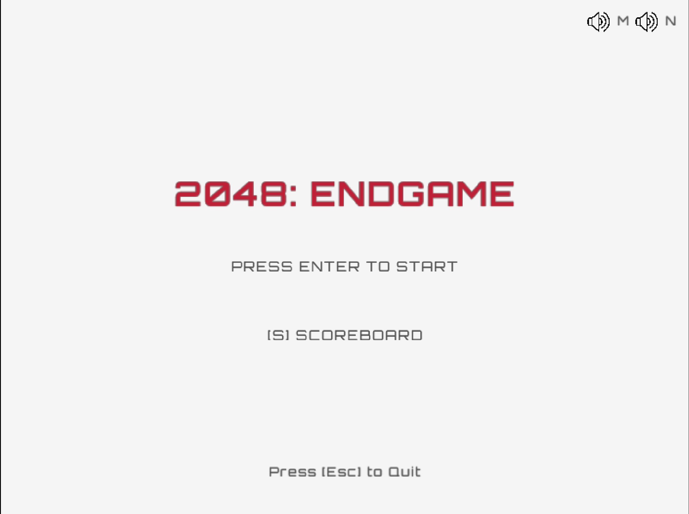
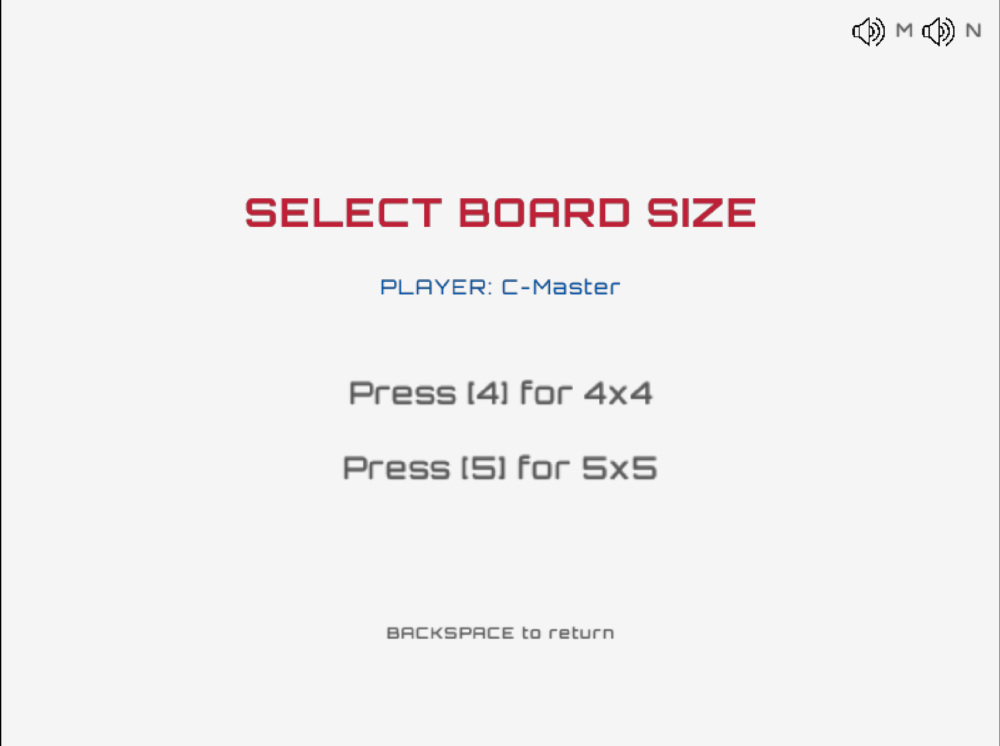
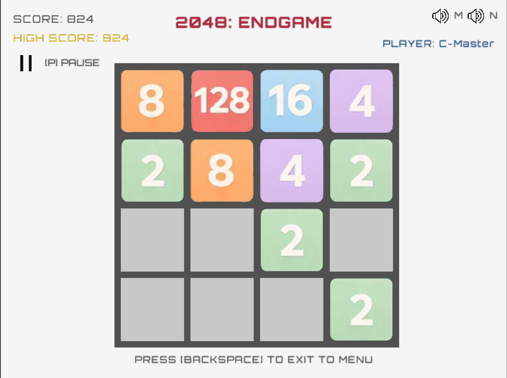
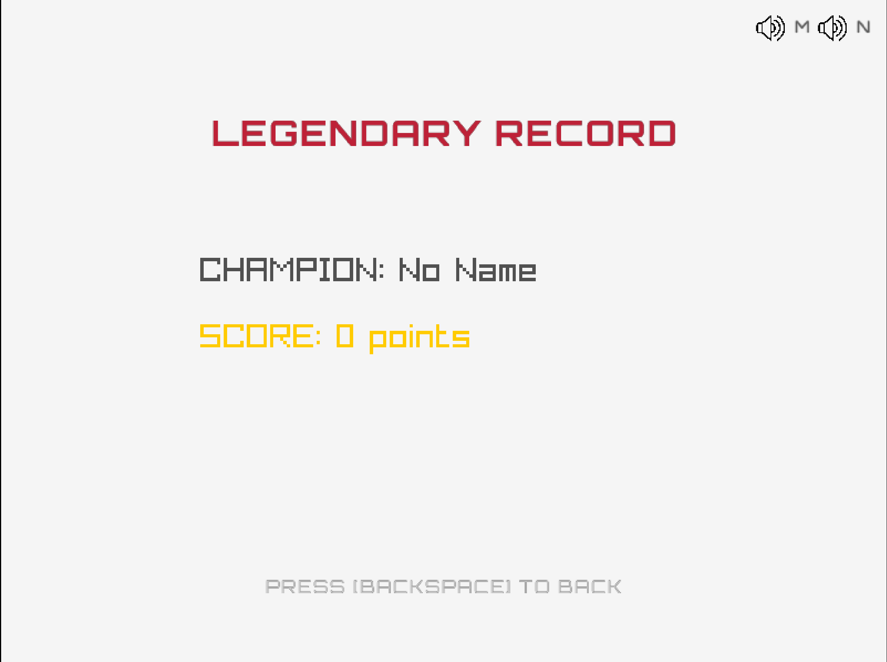

# 2048: Endgame Edition 🎮

A cross-platform implementation of the classic 2048 game built with **C** and **Raylib**. Developed as part of a university project/marathon.

## 🚀 Features

- **Cross-platform**: Support for Linux, Windows, and macOS.
- **Modern UI**: Clean design with custom textures and fonts.
- **Audio**: Sound effects for moves/merges and background music.
- **Persistent High Scores**: Saves your legendary records to a file.
- **CI/CD**: Automated builds via GitHub Actions.

## 🛠 Installation & Build

### Prerequisites

- A C compiler (`clang` or `gcc`)
- `make` build tool
- Raylib dependencies (for Linux)

### Cloning

Since this project uses submodules, use the following command:

```bash
git clone --recursive [https://github.com/MaxsimJSDeveloper/2048.git](https://github.com/MaxsimJSDeveloper/2048.git)

```

# 🎥 Presentation

[](https://www.youtube.com/watch?v=3-kpB6ZUXF4)
_Click the thumbnail above to watch the gameplay video!_

## 📸 Screenshots

|                                Start Menu                                |                                 Select Board                                 |                                 Game Process                                 |                                Scoreboard                                |
| :----------------------------------------------------------------------: | :--------------------------------------------------------------------------: | :--------------------------------------------------------------------------: | :----------------------------------------------------------------------: |
|  |  |  |  |
